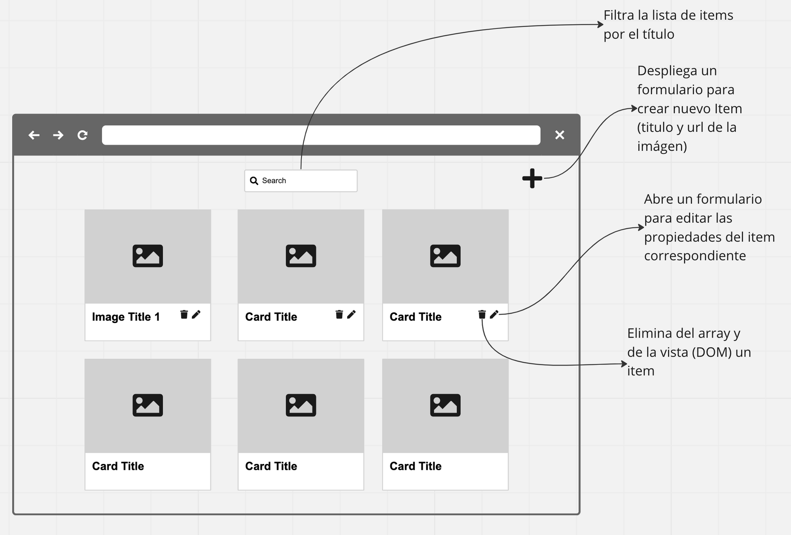

# Un ejercicio para crear un CRUD simple, en vanilla js

## [Demo](https://jaumevibu.github.io/simple-crud/)

TODO

- [x] añadir boton a cada item de la lista renderizada para borrar el item

- [x] añadir boton a cada item de la lista renderizada para editar el item.

  - [x] poner el texto del item dentro del input
  - [x] cambiar texto boton add por update
  - [x] al clickar, modificar el elemento del array (si esta en blanco no hacer nada)

---

Iteracion 2

- [x] preguntar url imagen a cada item e insertar imagen en la lista
- [x] añadir persistencia usando localstorage

---

Iteracion 3

- [ ] añadir input filtro
- [ ] refactorizar: el form de añadir este oculto hasta pulsar boton/icono
